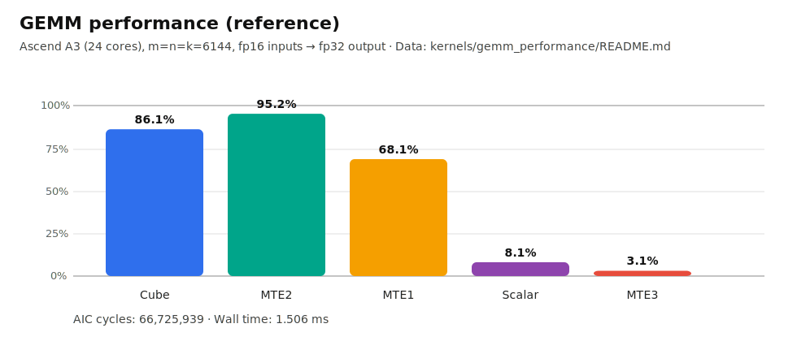
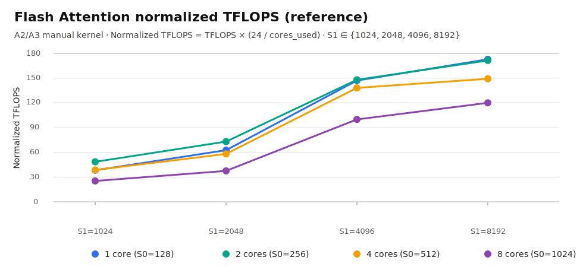

<p align="center">
  
</p>

# PTO Tile Lib

Parallel Tile Operation (PTO) is a virtual instruction set architecture designed by Ascend CANN, focusing on tile-level operations. This repository offers high-performance, cross-platform tile operations across Ascend platforms. By porting to PTO instruction sequences, users can migrate Ascend hardware more easily.

## News

* **2025-12-31**: PTO Tile Lib becomes publicly available.

## Overview

The PTO ISA (Instruction Set Architecture) is built on Ascend’s underlying hardware and software abstractions, providing over 90 standard tile-level operations.

Ascend hardware architectures have significantly evolved over generations, leading to major changes in the instruction sets. The PTO instruction set bridges these hardware differences by raising the abstraction level. We ensure that these PTO instructions work correctly across platforms while maintaining backward compatibility. However, this abstraction does not hide performance tuning opportunities. Users can still fine-tune performance by adjusting Tile sizes, Tile shapes, instruction order, Tile transformations, and other Tile operations. This provides sufficient control to fine-tune internal pipeline flows.

Our goal is to offer users a simplified, yet powerful way to optimize performance, enabling them to write high-performance code with PTO instructions.

Currently, PTO instructions are integrated into the following frameworks:

* [PyPTO](https://gitcode.com/cann/pypto/)
* [TileLang Ascend](https://github.com/tile-ai/tilelang-ascend/)

## Target Users of this Repository

PTO Tile Lib is not aimed at beginner-level users. The intended audience includes:

* Backend developers implementing frameworks that directly interface with Ascend hardware.
* Cross-platform application developers (NPU & GPU).
* High-performance operator developers (manual operator implementations).

## Performance

This repository includes performance-oriented kernels with reference measurements and reproducible setups.

### GEMM (A2/A3 reference)

- Kernel: `kernels/manual/a2a3/gemm_performance/`

Measured on Ascend A3 (24 cores) with fp16 inputs → fp32 output:

| Parameter | TMATMUL (Cube) Ratio | TEXTRACT Ratio | TLOAD Ratio | TSTORE Ratio | Execution time (ms) |
| --- | --- | --- | --- | --- | --- |
| `m=1536` `k=1536` `n=1536` | 54.5% | 42.2% | 72.2% | 7.7% | 0.0388 |
| `m=3072` `k=3072` `n=3072` | 79.0% | 62.0% | 90.9% | 5.8% | 0.2067 |
| `m=6144` `k=6144` `n=6144` | 86.7% | 68.1% | 95.2% | 3.1% | 1.5060 |
| `m=7680` `k=7680` `n=7680` | 80.6% | 63.0% | 98.4% | 2.4% | 3.1680 |

Detailed analysis and tuning notes: `kernels/manual/a2a3/gemm_performance/README.md`.



### Flash Attention (A2/A3 reference)

- Kernel: `kernels/manual/a2a3/flash_atten/`



## Coming Soon

The following features will be released in the future:

| Feature | Description | Scope |
| --- | --- | --- |
| PTO Auto Mode | BiSheng compiler support to automatically allocate tile buffers and insert synchronization. | Compiler / toolchain |
| PTO-AS | Assembler and disassembler for PTO ISA. | Developer tooling |
| Convolution extension | Tile library support for convolution kernels. | ISA Extension |
| Collective communication extension | Tile library support for multi-card communication. | ISA Extension |

## Design Philosophy of PTO Instructions

* **Tile as the Standard Unit**: Tile is a fixed unit that cannot be indexed by pointers, making it easier for compilers to perform alias analysis.
* **Static to Dynamic Conversion, Code Specialization**: Tiles are implemented without address or index calculations, removing dynamic Masks.
* **Reduced Flexibility for Higher Performance**: We write high-performance operators for standard Tile shapes, using the "container theory" where multiple choices for achieving the same performance are reduced. This minimizes the complexity for compilers and users.

## How to Use PTO Tile Library

PTO instructions support two modes: **Auto Mode** (where the user does not allocate buffers or manage pipelining) and **Manual Mode** (where the user must allocate buffer addresses and manage pipelining). We recommend the following steps for optimizing operators:

1. Develop the operator based on Auto Mode, generating PTO instruction sequences according to the algorithm logic.
2. Verify functionality and correctness in CPU simulation.
3. Port the code to Ascend hardware to ensure correctness and collect performance data.
4. Identify performance bottlenecks (CUBE Bound, MTE Bound, Vector Bound) and begin optimization and tuning.

We ensure that each PTO instruction, when implemented within a fixed Tile shape, fully leverages the capabilities of the underlying hardware. We encapsulate low-level hardware implementations into the Tile abstractions and utilize expert knowledge to create a variety of Tile templates. During static compilation, the compiler selects the best assembly implementation for the current shape based on template parameters. By merging different PTO instructions, we achieve optimal performance.

In this repository, we demonstrate how standard Tile operations can be mapped to various pipelines through template parameters:

* Static Tile Shape (Row, Col)
* Dynamic Tile Mask (Valid Mask)
* Event Record & Wait (Set wait flag)
* Specialized Fixed Function (SFU)
* Fixed Pipeline (FIXP)

PTO ISA defines over 90 standard operations. This repository implements a growing subset of them, with ongoing efforts to add more.

## Platform Support

* Ascend A2 (Ascend 910B)
* Ascend A3 (Ascend 910C)
* Ascend A5 (Ascend 950 )
* CPU (x86_64 / AArch64)

For more details please refer to [Released PTO ISA](include\README.md)

## Quickstart Guide

For detailed, OS-specific setup (Windows / Linux / macOS), see: [docs/getting-started.md](docs/getting-started.md).

### Run CPU Simulator (recommended first step)

CPU simulation is cross-platform and does not require Ascend drivers/CANN:

```bash
python3 tests/run_cpu.py --clean --verbose
```

Build & run the GEMM demo (optional):

```bash
python3 tests/run_cpu.py --demo gemm --verbose
```

Build & run the Flash Attention demo (optional):

```bash
python3 tests/run_cpu.py --demo flash_attn --verbose
```

### Running a Single ST Test Case

Running ST requires a working Ascend CANN environment and is typically Linux-only.

```bash
python3 tests/script/run_st.py -r [sim|npu] -v [a3|a5] -t [TEST_CASE] -g [GTEST_FILTER_CASE]
```

Note: the `a3` backend covers the A2/A3 family (`include/pto/npu/a2a3`).

Example:

```bash
python3 tests/script/run_st.py -r npu -v a3 -t tmatmul -g TMATMULTest.case1
python3 tests/script/run_st.py -r sim -v a5 -t tmatmul -g TMATMULTest.case1
```

### Running Recommended Test Suites

```bash
# Execute the following commands from the project root directory:
chmod +x ./tests/run_st.sh
./tests/run_st.sh a5 npu simple
./tests/run_st.sh a3 sim all
```

### Running CPU Simulation Tests

```bash
# Execute the following commands from the project root directory:
chmod +x ./tests/run_cpu_tests.sh
./tests/run_cpu_tests.sh

python3 tests/run_cpu.py --verbose
```

## Build / Run Instructions

### Configuring Environment Variables (Ascend CANN)

For example, if you use the CANN community package and install to the default path:

```bash
source /usr/local/Ascend/latest/bin/setenv.bash
```

If you install to `.../ascend-toolkit/latest`, use:

```bash
source /usr/local/Ascend/ascend-toolkit/latest/bin/setenv.bash
```

### One-click Build and Run

* Run Full ST Tests:

  ```bash
  chmod +x build.sh
  ./build.sh --run_all --a3 --sim
  ```
* Run Simplified ST Tests:

  ```bash
  chmod +x build.sh
  ./build.sh --run_simple --a5 --npu
  ```
* Packaging:

  ```bash
  chmod +x build.sh
  ./build.sh --pkg
  ```

## Documentation

* ISA Guide and Instruction Navigation: [docs/README.md](docs/README.md)
* ISA Instruction Documentation Index: [docs/isa/README.md](docs/isa/README.md)
* Developer Coding Documentation Index: [docs/coding/README.md](docs/coding/README.md)
* PTO ISA Programming Tutorial (C++ tile intrinsics): [docs/coding/tutorial.md](docs/coding/tutorial.md)
* Release notes: [ReleaseNote.md](ReleaseNote.md)
* Getting Started Guide (recommended to run on CPU before moving to NPU): [docs/getting-started.md](docs/getting-started.md)
* Security and Disclosure Process: [SECURITY.md](SECURITY.md)
* Directory-level Reading (Code Organization):

  * Build and Packaging (CMake): [cmake/README.md](cmake/README.md)
  * External Header Files and APIs: [include/README.md](include/README.md), [include/pto/README.md](include/pto/README.md)
  * NPU Implementation (Split by SoC): [include/pto/npu/README.md](include/pto/npu/README.md), [include/pto/npu/a2a3/README.md](include/pto/npu/a2a3/README.md), [include/pto/npu/a5/README.md](include/pto/npu/a5/README.md)
  * Kernel/Custom Operators: [kernels/README.md](kernels/README.md), [kernels/custom/README.md](kernels/custom/README.md)
  * Testing and Use Cases: [tests/README.md](tests/README.md), [tests/script/README.md](tests/script/README.md)
  * Packaging Scripts: [scripts/README.md](scripts/README.md), [scripts/package/README.md](scripts/package/README.md)

## Repository Structure

* `include/`: PTO C++ header files (see [include/README.md](include/README.md))
* `kernels/`: Custom operators and kernel implementations (see [kernels/README.md](kernels/README.md))
* `docs/`: ISA instructions, API guidelines, and examples (see [docs/README.md](docs/README.md))
* `tests/`: ST/CPU test scripts and use cases (see [tests/README.md](tests/README.md))
* `scripts/`: Packaging and release scripts (see [scripts/README.md](scripts/README.md))
* `build.sh`, `tests/run_st.sh`: Build, package, and example run entry points

## License

This project is licensed under the CANN Open Software License Agreement Version 2.0. See the `LICENSE` file for details.
