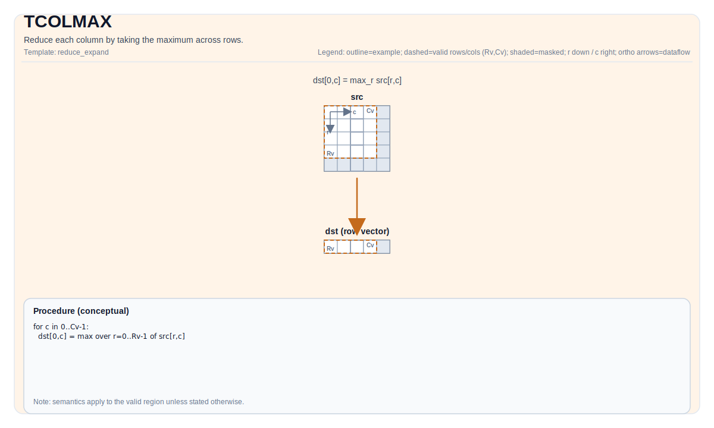

# TCOLMAX

## 指令示意图



## 简介

通过取行间最大值来归约每一列。

## 数学语义

Let `R = src.GetValidRow()` and `C = src.GetValidCol()`. For `0 <= j < C`:

$$ \mathrm{dst}_{0,j} = \max_{0 \le i < R} \mathrm{src}_{i,j} $$

## 汇编语法

PTO-AS 形式：参见 `docs/grammar/PTO-AS.md`.

同步形式：

```text
%dst = tcolmax %src : !pto.tile<...> -> !pto.tile<...>
```

### IR Level 1（SSA）

```text
%dst = pto.tcolmax %src : !pto.tile<...> -> !pto.tile<...>
```

### IR Level 2（DPS）

```text
pto.tcolmax ins(%src : !pto.tile_buf<...>) outs(%dst : !pto.tile_buf<...>)
```

## C++ 内建接口

声明于 `include/pto/common/pto_instr.hpp`:

```cpp
template <typename TileDataOut, typename TileDataIn, typename... WaitEvents>
PTO_INST RecordEvent TCOLMAX(TileDataOut& dst, TileDataIn& src, WaitEvents&... events);
```

## 约束

实现检查 (NPU):

- Tile location: `dst` and `src` must be `TileType::Vec`.
- Tile 布局: both tiles must be ND fractal (`isRowMajor` and `SLayout::NoneBox`).
- 数据类型:
  - A2A3: `half`, `float`, `int16_t`, `int32_t`.
  - A5: `half`, `float`, `int8_t`, `uint8_t`, `int16_t`, `uint16_t`, `int32_t`, `uint32_t`, `bfloat16_t`.
- 数据类型一致性: `dst.DType == src.DType`.
- 运行期有效区域检查:
  - `src.GetValidCol() == dst.GetValidCol()`.
  - If `src.GetValidRow() == 0` or `src.GetValidCol() == 0`, the implementation returns early.

## 示例

### 自动（Auto）

```cpp
#include <pto/pto-inst.hpp>

using namespace pto;

void example_auto() {
  using SrcT = Tile<TileType::Vec, float, 16, 16>;
  using DstT = Tile<TileType::Vec, float, 1, 16>;
  SrcT src;
  DstT dst;
  TCOLMAX(dst, src);
}
```

### 手动（Manual）

```cpp
#include <pto/pto-inst.hpp>

using namespace pto;

void example_manual() {
  using SrcT = Tile<TileType::Vec, float, 16, 16>;
  using DstT = Tile<TileType::Vec, float, 1, 16>;
  SrcT src;
  DstT dst;
  TASSIGN(src, 0x1000);
  TASSIGN(dst, 0x2000);
  TCOLMAX(dst, src);
}
```

## 汇编示例（ASM）

### 自动模式

```text
# 自动模式：由编译器/运行时负责资源放置与调度。
%dst = pto.tcolmax %src : !pto.tile<...> -> !pto.tile<...>
```

### 手动模式

```text
# 手动模式：先显式绑定资源，再发射指令。
# 可选（当该指令包含 tile 操作数时）：
# pto.tassign %arg0, @tile(0x1000)
# pto.tassign %arg1, @tile(0x2000)
%dst = pto.tcolmax %src : !pto.tile<...> -> !pto.tile<...>
```

### PTO 汇编形式

```text
%dst = tcolmax %src : !pto.tile<...> -> !pto.tile<...>
# IR Level 2 (DPS)
pto.tcolmax ins(%src : !pto.tile_buf<...>) outs(%dst : !pto.tile_buf<...>)
```

