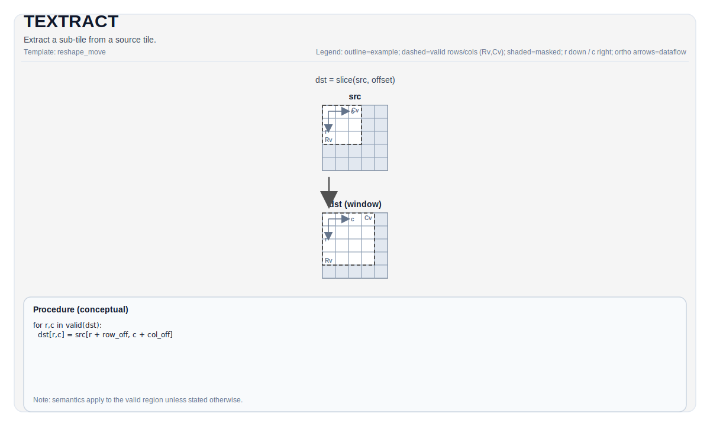

# TEXTRACT

## 指令示意图



## 简介

从源 Tile 中提取子 Tile。

## 数学语义

Conceptually copies a window starting at `(indexRow, indexCol)` from `src` into `dst`. Exact mapping depends on layouts.

Let `R = dst.GetValidRow()` and `C = dst.GetValidCol()`. For `0 <= i < R` and `0 <= j < C`:

$$ \mathrm{dst}_{i,j} = \mathrm{src}_{\mathrm{indexRow}+i,\; \mathrm{indexCol}+j} $$

## 汇编语法

PTO-AS 形式：参见 `docs/grammar/PTO-AS.md`.

同步形式：

```text
%dst = textract %src[%r0, %r1] : !pto.tile<...> -> !pto.tile<...>
```

### IR Level 1（SSA）

```text
%dst = pto.textract %src, %idxrow, %idxcol : (!pto.tile<...>, dtype, dtype) -> !pto.tile<...>
```

### IR Level 2（DPS）

```text
pto.textract ins(%src, %idxrow, %idxcol : !pto.tile_buf<...>, dtype, dtype) outs(%dst : !pto.tile_buf<...>)
```

## C++ 内建接口

声明于 `include/pto/common/pto_instr.hpp`:

```cpp
template <typename DstTileData, typename SrcTileData, typename... WaitEvents>
PTO_INST RecordEvent TEXTRACT(DstTileData& dst, SrcTileData& src, uint16_t indexRow = 0, uint16_t indexCol = 0,
                              WaitEvents&... events);
```

## 约束

- **实现检查 (A2A3)**:
  - `DstTileData::DType` must equal `SrcTileData::DType` and must be one of: `int8_t`, `half`, `bfloat16_t`, `float`.
  - Source fractal must satisfy: `(SFractal == ColMajor && isRowMajor)` or `(SFractal == RowMajor && !isRowMajor)`.
  - Runtime bounds checks:
    - `indexRow + DstTileData::Rows <= SrcTileData::Rows`
    - `indexCol + DstTileData::Cols <= SrcTileData::Cols`
  - Destination must be `TileType::Left` or `TileType::Right` with a target-supported fractal configuration.
- **实现检查 (A5)**:
  - `DstTileData::DType` must equal `SrcTileData::DType` and must be one of: `int8_t`, `hifloat8_t`, `float8_e5m2_t`, `float8_e4m3_t`, `half`, `bfloat16_t`, `float`, `float4_e2m1x2_t`, `float4_e1m2x2_t`, `float8_e8m0_t`.
  - Source fractal must satisfy: `(SFractal == ColMajor && isRowMajor)` or `(SFractal == RowMajor && !isRowMajor)` for Left/Right, `(SFractal == RowMajor && isRowMajor)` for ScaleLeft, `(SFractal == ColMajor && !isRowMajor)` for ScaleRight.
  - Destination supports `Mat -> Left/Right/Scale` and also supports `Vec -> Mat` for specific tile locations (no explicit runtime bounds assertions are enforced in `TEXTRACT_IMPL` on this target).

## 示例

### 自动（Auto）

```cpp
#include <pto/pto-inst.hpp>

using namespace pto;

void example_auto() {
  using SrcT = Tile<TileType::Mat, float, 16, 16, BLayout::RowMajor, 16, 16, SLayout::ColMajor>;
  using DstT = TileLeft<float, 16, 16>;
  SrcT src;
  DstT dst;
  TEXTRACT(dst, src, /*indexRow=*/0, /*indexCol=*/0);
}
```

### 手动（Manual）

```cpp
#include <pto/pto-inst.hpp>

using namespace pto;

void example_manual() {
  using SrcT = Tile<TileType::Mat, float, 16, 16, BLayout::RowMajor, 16, 16, SLayout::ColMajor>;
  using DstT = TileLeft<float, 16, 16>;
  SrcT src;
  DstT dst;
  TASSIGN(src, 0x1000);
  TASSIGN(dst, 0x2000);
  TEXTRACT(dst, src, /*indexRow=*/0, /*indexCol=*/0);
}
```

## 汇编示例（ASM）

### 自动模式

```text
# 自动模式：由编译器/运行时负责资源放置与调度。
%dst = pto.textract %src, %idxrow, %idxcol : (!pto.tile<...>, dtype, dtype) -> !pto.tile<...>
```

### 手动模式

```text
# 手动模式：先显式绑定资源，再发射指令。
# 可选（当该指令包含 tile 操作数时）：
# pto.tassign %arg0, @tile(0x1000)
# pto.tassign %arg1, @tile(0x2000)
%dst = pto.textract %src, %idxrow, %idxcol : (!pto.tile<...>, dtype, dtype) -> !pto.tile<...>
```

### PTO 汇编形式

```text
%dst = textract %src[%r0, %r1] : !pto.tile<...> -> !pto.tile<...>
# IR Level 2 (DPS)
pto.textract ins(%src, %idxrow, %idxcol : !pto.tile_buf<...>, dtype, dtype) outs(%dst : !pto.tile_buf<...>)
```

