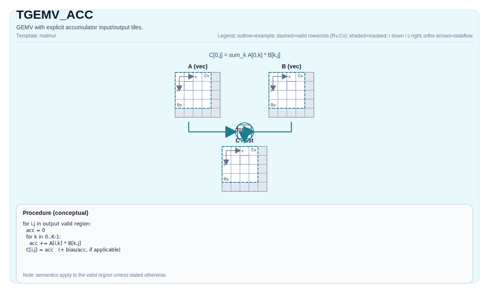

# TGEMV_ACC

## 指令示意图



## 简介

带显式累加器输入/输出 Tile 的 GEMV。

## 数学语义

除非另有说明, semantics are defined over the valid region and target-dependent behavior is marked as implementation-defined.

## 汇编语法

PTO-AS 形式：参见 `docs/grammar/PTO-AS.md`.

### IR Level 1（SSA）

```text
%c = pto.tgemv %a, %b : (!pto.tile<...>, !pto.tile<...>) -> !pto.tile<...>
%c_out = pto.tgemv.acc %c_in, %a, %b : (!pto.tile<...>, !pto.tile<...>, !pto.tile<...>) -> !pto.tile<...>
%c = pto.tgemv.bias %a, %b, %bias : (!pto.tile<...>, !pto.tile<...>, !pto.tile<...>) -> !pto.tile<...>
```

### IR Level 2（DPS）

```text
pto.tgemv ins(%a, %b : !pto.tile_buf<...>, !pto.tile_buf<...>) outs(%c : !pto.tile_buf<...>)
pto.tgemv.acc ins(%c_in, %a, %b : !pto.tile_buf<...>, !pto.tile_buf<...>, !pto.tile_buf<...>) outs(%c_out : !pto.tile_buf<...>)
pto.tgemv.bias ins(%a, %b, %bias : !pto.tile_buf<...>, !pto.tile_buf<...>, !pto.tile_buf<...>) outs(%c : !pto.tile_buf<...>)
```

## C++ 内建接口

声明于 `include/pto/common/pto_instr.hpp`:

```cpp
template <typename TileRes, typename TileLeft, typename TileRight, typename... WaitEvents>
PTO_INST RecordEvent TGEMV_ACC(TileRes &cOutMatrix, TileRes &cInMatrix, TileLeft &aMatrix, TileRight &bMatrix,
  WaitEvents&... events);
```

## 约束

Type/layout/location/shape legality is backend-dependent; treat implementation-specific notes as normative for that backend.

## 示例

See related examples in `docs/isa/` and `docs/coding/tutorials/`.
