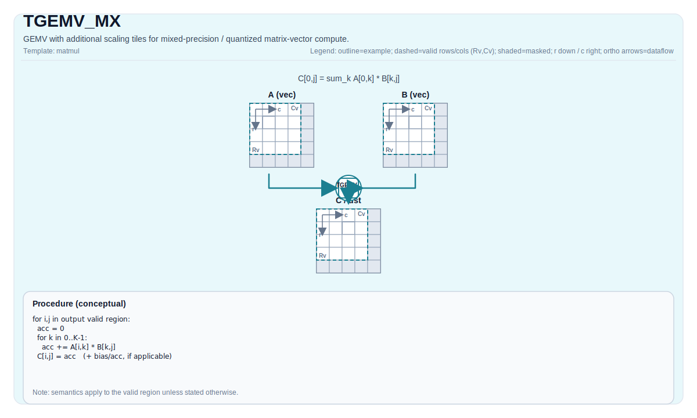

# TGEMV_MX

## 指令示意图



## 简介

带缩放 Tile 的 GEMV 变体，支持混合精度/量化矩阵向量计算。

## 数学语义

Conceptually (base GEMV path):

$$
\mathrm{C}_{0,j} = \sum_{k=0}^{K-1} \mathrm{A}_{0,k} \cdot \mathrm{B}_{k,j}
$$

For `TGEMV_MX`, scale tiles participate in implementation-defined mixed-precision reconstruction / scaling. The architectural contract is that output corresponds to the target-defined mx GEMV semantics.

## 汇编语法

PTO-AS 形式：参见 `docs/grammar/PTO-AS.md`.

Schematic form:

```text
%acc = tgemv.mx %a, %a_scale, %b, %b_scale : (!pto.tile<...>, !pto.tile<...>, !pto.tile<...>, !pto.tile<...>) -> !pto.tile<...>
```

### IR Level 1（SSA）

```text
%acc = pto.tgemv.mx %a, %a_scale, %b, %b_scale : (!pto.tile<...>, !pto.tile<...>, !pto.tile<...>, !pto.tile<...>) -> !pto.tile<...>
```

### IR Level 2（DPS）

```text
pto.tgemv.mx ins(%a, %a_scale, %b, %b_scale : (!pto.tile_buf<...>, !pto.tile_buf<...>, !pto.tile_buf<...>, !pto.tile_buf<...>)) outs(%acc : !pto.tile_buf<...>)
```

## C++ 内建接口

声明于 `include/pto/common/pto_instr.hpp`:

```cpp
template <typename TileRes, typename TileLeft, typename TileLeftScale, typename TileRight, typename TileRightScale,
          typename... WaitEvents>
PTO_INST RecordEvent TGEMV_MX(TileRes &cMatrix, TileLeft &aMatrix, TileLeftScale &aScaleMatrix,
                              TileRight &bMatrix, TileRightScale &bScaleMatrix, WaitEvents &... events);
```

Additional overloads support accumulation/bias variants and `AccPhase` selection.

## 约束

- Uses backend-specific mx legality checks for data types, tile locations, fractal/layout combinations, and scaling formats.
- Scale tile compatibility and accumulator promotion are implementation-defined by target backend.
- For portability, validate the exact `(A, B, scaleA, scaleB, C)` type tuple and tile layout against target implementation constraints.

## 示例

For practical usage patterns, see:

- `docs/isa/TMATMUL_MX.md`
- `docs/isa/TGEMV.md`
