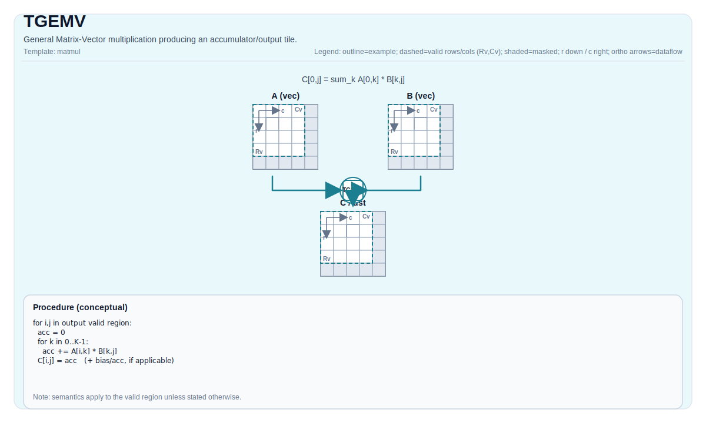

# TGEMV

## 指令示意图



## 简介

通用矩阵-向量乘法，生成累加器/输出 Tile。

## 数学语义

Let:

- `M = 1`
- `K = bMatrix.GetValidRow()`
- `N = bMatrix.GetValidCol()`

### 1. TGEMV (Tile-based GEMV)

For `0 <= j < N` (output elements in the effective matmul domain):

$$ \mathrm{C}_{0,j} = \sum_{k=0}^{K-1} \mathrm{A}_{0,k} \cdot \mathrm{B}_{k,j} $$

### 2. TGEMV_ACC (Tile-based GEMV with Accumulation)

For `0 <= j < N` (accumulates into existing tile):

$$ \mathrm{C}_{0,j} \gets \mathrm{C}_{0,j} + \sum_{k=0}^{K-1} \mathrm{A}_{0,k} \cdot \mathrm{B}_{k,j} $$

### 3. TGEMV_BIAS (Tile-based GEMV with Bias)

For `0 <= j < N` (adds bias term to matrix product):

$$ \mathrm{C}_{0,j} = \mathrm{Bias}_{0,j} + \sum_{k=0}^{K-1} \mathrm{A}_{0,k} \cdot \mathrm{B}_{k,j} $$

**Note:** Exact accumulator behavior and datatype promotion are target/implementation-defined.

## 汇编语法

PTO-AS 形式：参见 `docs/grammar/PTO-AS.md`.

同步形式：

```text
%acc = tgemv %a, %b : (!pto.tile<...>, !pto.tile<...>) -> !pto.tile<...>

%acc1 = tgemv.acc %acc0, %a, %b : (!pto.tile<...>, !pto.tile<...>, !pto.tile<...>) -> !pto.tile<...>

%acc = tgemv.bias %a, %b, %bias : (!pto.tile<...>, !pto.tile<...>, !pto.tile<...>) -> !pto.tile<...>
```

### IR Level 1（SSA）

```text
%c = pto.tgemv %a, %b : (!pto.tile<...>, !pto.tile<...>) -> !pto.tile<...>
%c_out = pto.tgemv.acc %c_in, %a, %b : (!pto.tile<...>, !pto.tile<...>, !pto.tile<...>) -> !pto.tile<...>
%c = pto.tgemv.bias %a, %b, %bias : (!pto.tile<...>, !pto.tile<...>, !pto.tile<...>) -> !pto.tile<...>
```

### IR Level 2（DPS）

```text
pto.tgemv ins(%a, %b : !pto.tile_buf<...>, !pto.tile_buf<...>) outs(%c : !pto.tile_buf<...>)
pto.tgemv.acc ins(%c_in, %a, %b : !pto.tile_buf<...>, !pto.tile_buf<...>, !pto.tile_buf<...>) outs(%c_out : !pto.tile_buf<...>)
pto.tgemv.bias ins(%a, %b, %bias : !pto.tile_buf<...>, !pto.tile_buf<...>, !pto.tile_buf<...>) outs(%c : !pto.tile_buf<...>)
```

## C++ 内建接口

声明于 `include/pto/common/pto_instr.hpp`:

```cpp
template <typename TileRes, typename TileLeft, typename TileRight, typename... WaitEvents>
PTO_INST RecordEvent TGEMV(TileRes &cMatrix, TileLeft &aMatrix, TileRight &bMatrix, WaitEvents&... events);

template <typename TileRes, typename TileLeft, typename TileRight, typename... WaitEvents>
PTO_INST RecordEvent TGEMV_ACC(TileRes &cOutMatrix, TileRes &cInMatrix, TileLeft &aMatrix, TileRight &bMatrix, WaitEvents&... events);

template <typename TileRes, typename TileLeft, typename TileRight, typename TileBias, typename... WaitEvents>
PTO_INST RecordEvent TGEMV_BIAS(TileRes &cMatrix, TileLeft &aMatrix, TileRight &bMatrix, TileBias &biasData, WaitEvents&... events);
```

## 约束

- **实现检查 (A2A3)**:
  - Supported `(CType, AType, BType)` triples:
    - `(int32_t, int8_t, int8_t)`
    - `(float, half, half)`
    - `(float, float, float)`
    - `(float, bfloat16_t, bfloat16_t)`
  - Static shape constraints: `TileLeft::Rows == TileRes::Rows`, `TileLeft::Cols == TileRight::Rows`, `TileRight::Cols == TileRes::Cols`.
  - Tile locations: `TileLeft::Loc == Left`, `TileRight::Loc == Right`, `TileRes::Loc == Acc`.
  - Runtime: `m` must be 1 ; `k/n` (taken from `bMatrix.GetValidRow()`, `bMatrix.GetValidCol()`) must be in `[1, 4095]`.
  - Bias checks:
    - The data type of the bias tile `TileBias::DType` must exactly match the data type of the result tile `(TileRes::DType)`.
    - The bias tile must be configured as a single row.
    - The bias tile's location must be `TileBias::Loc == TileType::Bias`.
- **实现检查 (A5)**:
  - Accumulator type must be `int32_t` or `float`.
    - If `int32_t`: `AType == int8_t` and `BType == int8_t`.
    - If `float`: supports `half/bfloat16_t/float` and selected fp8 pairs (target-defined).
  - Static shape constraints: `TileLeft::Rows == TileRes::Rows`, `TileLeft::Cols == TileRight::Rows`, `TileRight::Cols == TileRes::Cols`.
  - Fractal/layout constraints are enforced:
    - Left: `Loc == Left`, `!isRowMajor`, `SFractal == RowMajor`
    - Right: `Loc == Right`, `isRowMajor`, `SFractal == ColMajor`
    - Acc: `Loc == Acc`, `!isRowMajor`, `SFractal == RowMajor`
  - No explicit runtime range checks on `m/k/n` are enforced in `TMATMUL_IMPL` on this target.
  - Runtime: `m` must be 1 ; `k/n` (taken from `bMatrix.GetValidRow()`, `bMatrix.GetValidCol()`) must be in `[1, 4095]`.
  - Bias checks:
    - The data type of the bias tile `TileBias::DType` must exactly match the data type of the result tile `(TileRes::DType)`.
    - The bias tile must be configured as a single row.
    - The bias tile's location must be `TileBias::Loc == TileType::Bias`.

## 示例

### 自动（Auto）

#### 1. TGEMV

```cpp
#include <pto/pto-inst.hpp>

using namespace pto;

void example_auto() {
  using A = TileLeft<half, 1, 16>;
  using B = TileRight<half, 16, 16>;
  using C = TileAcc<float, 1, 16>;
  A a;
  B b;
  C c;
  TGEMV(c, a, b);
}
```

#### 2. TGEMV_ACC

```cpp
#include <pto/pto-inst.hpp>

using namespace pto;

void example_auto() {
  using A = TileLeft<half, 1, 16>;
  using B = TileRight<half, 16, 16>;
  using C = TileAcc<float, 1, 16>;
  A a;
  B b;
  C c0, c1;
  TGEMV_ACC(c, a, b);
}
```

#### 3. TGEMV_BIAS

```cpp
#include <pto/pto-inst.hpp>

using namespace pto;

void example_auto() {
  using A = TileLeft<half, 1, 16>;
  using B = TileRight<half, 16, 16>;
  using Bias = Tile<TileType::Bias, half, 1, 16>;
  using C = TileAcc<float, 1, 16>;
  A a;
  B b;
  Bias bias;
  C c;
  TGEMV_BIAS(c, a, b, bias);
}
```

### 手动（Manual）

#### 1. TGEMV

```cpp
#include <pto/pto-inst.hpp>

using namespace pto;

void example_manual() {
  using A = TileLeft<half, 1, 16>;
  using B = TileRight<half, 16, 16>;
  using C = TileAcc<float, 1, 16>;
  A a;
  B b;
  C c;
  TASSIGN(a, 0x1000);
  TASSIGN(b, 0x2000);
  TASSIGN(c, 0x3000);
  TGEMV(c, a, b);
}
```

#### 2. TGEMV_ACC

```cpp
#include <pto/pto-inst.hpp>

using namespace pto;

void example_manual() {
  using A = TileLeft<half, 1, 16>;
  using B = TileRight<half, 16, 16>;
  using C = TileAcc<float, 1, 16>;
  A a;
  B b;
  C c0, c1;
  TASSIGN(a, 0x1000);
  TASSIGN(b, 0x2000);
  TASSIGN(c0, 0x3000);
  TASSIGN(c1, 0x4000);
  TGEMV_ACC(c1, c0, a, b);
}
```

#### 3. TGEMV_BIAS

```cpp
#include <pto/pto-inst.hpp>

using namespace pto;

void example_manual() {
  using A = TileLeft<half, 1, 16>;
  using B = TileRight<half, 16, 16>;
  using Bias = Tile<TileType::Bias, half, 1, 16>;
  using C = TileAcc<float, 1, 16>;
  A a;
  B b;
  Bias bias;
  C c;
  TASSIGN(a, 0x1000);
  TASSIGN(b, 0x2000);
  TASSIGN(bias, 0x3000);
  TASSIGN(c, 0x4000);
  TGEMV_BIAS(c, a, b, bias);
}
```
