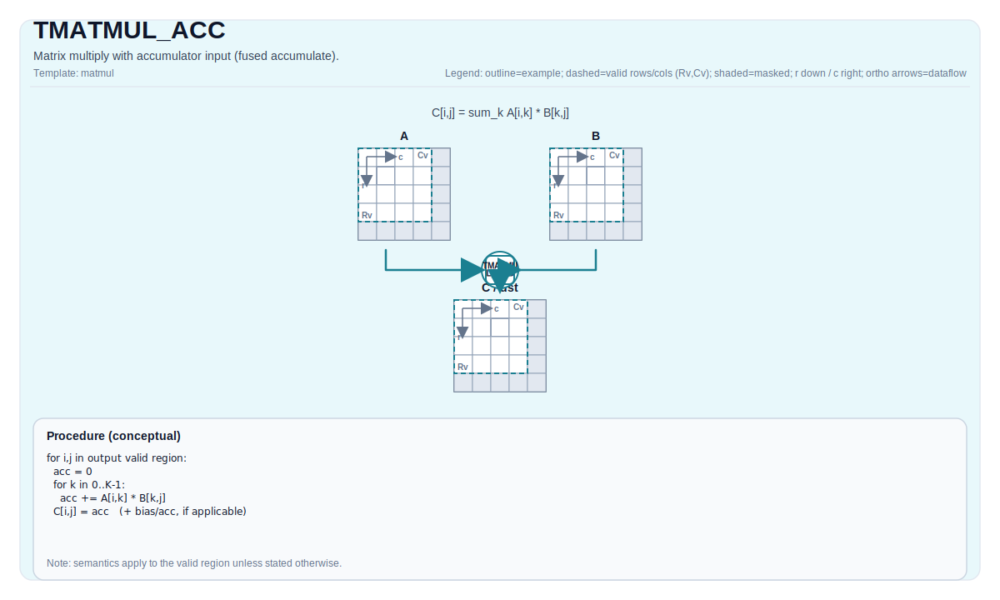

# TMATMUL_ACC


## Tile Operation Diagram



## Introduction

Matrix multiply with accumulator input (fused accumulate).

## Math Interpretation

Let:

- `M = aMatrix.GetValidRow()`
- `K = aMatrix.GetValidCol()`
- `N = bMatrix.GetValidCol()`

For `0 <= i < M` and `0 <= j < N`:

$$ \mathrm{C1}_{i,j} = \mathrm{C0}_{i,j} + \sum_{k=0}^{K-1} \mathrm{A}_{i,k} \cdot \mathrm{B}_{k,j} $$

## Assembly Syntax

PTO-AS form: see `docs/grammar/PTO-AS.md`.

Synchronous form:

```text
%acc1 = tmatmul.acc %acc0, %a, %b : (!pto.tile<...>, !pto.tile<...>, !pto.tile<...>) -> !pto.tile<...>
```

### IR Level 1 (SSA)

```text
%c_out = pto.tmatmul.acc %c_in, %a, %b : (!pto.tile<...>, !pto.tile<...>, !pto.tile<...>) -> !pto.tile<...>
```

### IR Level 2 (DPS)

```text
pto.tmatmul.acc ins(%c_in, %a, %b : !pto.tile_buf<...>, !pto.tile_buf<...>, !pto.tile_buf<...>) outs(%c_out : !pto.tile_buf<...>)
```
## C++ Intrinsic

Declared in `include/pto/common/pto_instr.hpp`:

```cpp
template <typename TileRes, typename TileLeft, typename TileRight, typename... WaitEvents>
PTO_INST RecordEvent TMATMUL_ACC(TileRes& cOutMatrix, TileRes& cInMatrix, TileLeft& aMatrix, TileRight& bMatrix,
                                 WaitEvents&... events);
```

## Constraints

- All constraints from `TMATMUL` apply to the `(cOutMatrix, aMatrix, bMatrix)` triple.
- **Implementation notes (A2A3/A5)**:
  - `TMATMUL_ACC_IMPL` uses `aMatrix.GetValidRow()`, `aMatrix.GetValidCol()`, and `bMatrix.GetValidCol()` for `m/k/n`.
  - `cInMatrix` is not validated by explicit assertions in the current implementations (target-defined behavior).

## Examples

### Auto

```cpp
#include <pto/pto-inst.hpp>

using namespace pto;

void example_auto() {
  using A = TileLeft<half, 16, 16>;
  using B = TileRight<half, 16, 16>;
  using C = TileAcc<float, 16, 16>;
  A a;
  B b;
  C c0, c1;
  TMATMUL_ACC(c1, c0, a, b);
}
```

### Manual

```cpp
#include <pto/pto-inst.hpp>

using namespace pto;

void example_manual() {
  using A = TileLeft<half, 16, 16>;
  using B = TileRight<half, 16, 16>;
  using C = TileAcc<float, 16, 16>;
  A a;
  B b;
  C c0, c1;
  TASSIGN(a, 0x1000);
  TASSIGN(b, 0x2000);
  TASSIGN(c0, 0x3000);
  TASSIGN(c1, 0x4000);
  TMATMUL_ACC(c1, c0, a, b);
}
```
