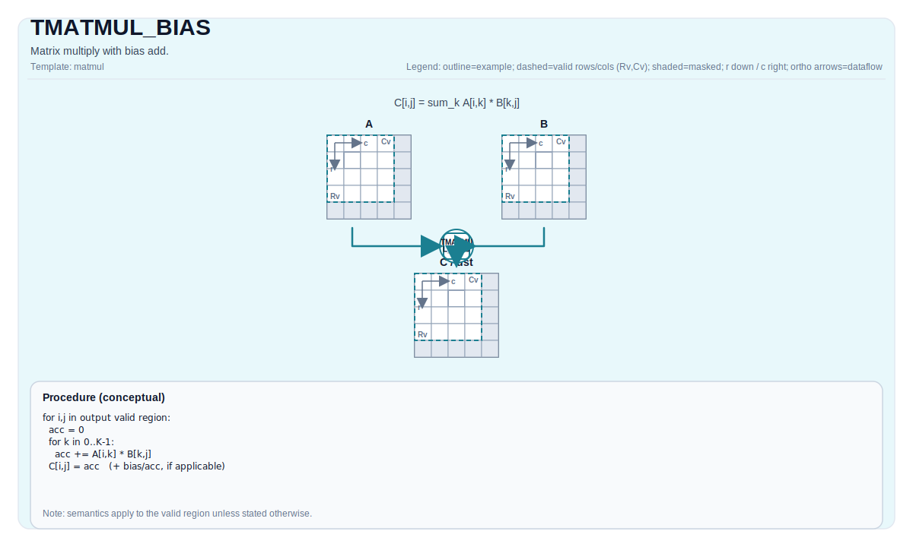

# TMATMUL_BIAS

## 指令示意图



## 简介

带偏置加法的矩阵乘法。

## 数学语义

Let:

- `M = aMatrix.GetValidRow()`
- `K = aMatrix.GetValidCol()`
- `N = bMatrix.GetValidCol()`

For `0 <= i < M` and `0 <= j < N`:

$$ \mathrm{C}_{i,j} = \sum_{k=0}^{K-1} \mathrm{A}_{i,k} \cdot \mathrm{B}_{k,j} + \mathrm{Bias}_{0,j} $$

Bias broadcasting behavior is implementation-defined.

## 汇编语法

PTO-AS 形式：参见 `docs/grammar/PTO-AS.md`.

同步形式：

```text
%acc = tmatmul.bias %a, %b, %bias : (!pto.tile<...>, !pto.tile<...>, !pto.tile<...>) -> !pto.tile<...>
```

### IR Level 1（SSA）

```text
%c = pto.tmatmul.bias %a, %b, %bias : (!pto.tile<...>, !pto.tile<...>, !pto.tile<...>) -> !pto.tile<...>
```

### IR Level 2（DPS）

```text
pto.tmatmul.bias ins(%a, %b, %bias : !pto.tile_buf<...>, !pto.tile_buf<...>, !pto.tile_buf<...>) outs(%c : !pto.tile_buf<...>)
```

## C++ 内建接口

声明于 `include/pto/common/pto_instr.hpp`:

```cpp
template <typename TileRes, typename TileLeft, typename TileRight, typename TileBias, typename... WaitEvents>
PTO_INST RecordEvent TMATMUL_BIAS(TileRes& cMatrix, TileLeft& aMatrix, TileRight& bMatrix, TileBias& biasData,
                                  WaitEvents&... events);
```

## 约束

- All constraints from `TMATMUL` apply to the `(cMatrix, aMatrix, bMatrix)` triple.
- **Bias constraints (A2A3)**:
  - `TileBias::DType` must match `TileRes::DType`.
  - `TileBias::Loc == TileType::Bias` and `TileBias::Rows == 1`.
- **Bias constraints (A5)**:
  - `TileBias::DType` must match `TileRes::DType`.
  - `TileBias::Loc == TileType::Bias`, `TileBias::Rows == 1`, and `TileBias::isRowMajor`.

## 示例

### 自动（Auto）

```cpp
#include <pto/pto-inst.hpp>

using namespace pto;

void example_auto() {
  using A = TileLeft<half, 16, 16>;
  using B = TileRight<half, 16, 16>;
  using Bias = Tile<TileType::Bias, half, 1, 16>;
  using C = TileAcc<float, 16, 16>;
  A a;
  B b;
  Bias bias;
  C c;
  TMATMUL_BIAS(c, a, b, bias);
}
```

### 手动（Manual）

```cpp
#include <pto/pto-inst.hpp>

using namespace pto;

void example_manual() {
  using A = TileLeft<half, 16, 16>;
  using B = TileRight<half, 16, 16>;
  using Bias = Tile<TileType::Bias, half, 1, 16>;
  using C = TileAcc<float, 16, 16>;
  A a;
  B b;
  Bias bias;
  C c;
  TASSIGN(a, 0x1000);
  TASSIGN(b, 0x2000);
  TASSIGN(bias, 0x3000);
  TASSIGN(c, 0x4000);
  TMATMUL_BIAS(c, a, b, bias);
}
```

## 汇编示例（ASM）

### 自动模式

```text
# 自动模式：由编译器/运行时负责资源放置与调度。
%c = pto.tmatmul.bias %a, %b, %bias : (!pto.tile<...>, !pto.tile<...>, !pto.tile<...>) -> !pto.tile<...>
```

### 手动模式

```text
# 手动模式：先显式绑定资源，再发射指令。
# 可选（当该指令包含 tile 操作数时）：
# pto.tassign %arg0, @tile(0x1000)
# pto.tassign %arg1, @tile(0x2000)
%c = pto.tmatmul.bias %a, %b, %bias : (!pto.tile<...>, !pto.tile<...>, !pto.tile<...>) -> !pto.tile<...>
```

### PTO 汇编形式

```text
%acc = tmatmul.bias %a, %b, %bias : (!pto.tile<...>, !pto.tile<...>, !pto.tile<...>) -> !pto.tile<...>
# IR Level 2 (DPS)
pto.tmatmul.bias ins(%a, %b, %bias : !pto.tile_buf<...>, !pto.tile_buf<...>, !pto.tile_buf<...>) outs(%c : !pto.tile_buf<...>)
```

