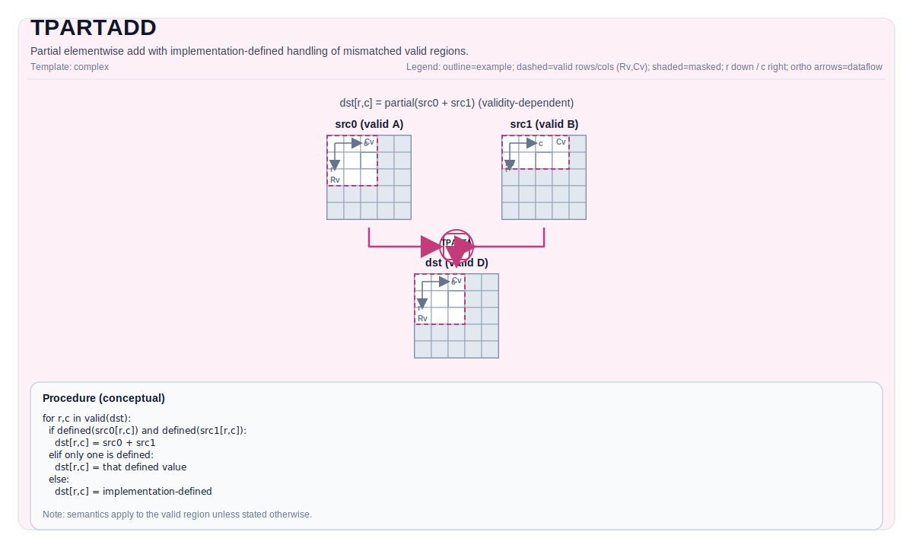

# TPARTADD

## 指令示意图



## 简介

部分逐元素加法，对不匹配的有效区域具有实现定义的处理方式。

## 数学语义

对每个元素 `(i, j)` in the destination valid region:

$$
\mathrm{dst}_{i,j} =
\begin{cases}
\mathrm{src0}_{i,j} + \mathrm{src1}_{i,j} & \text{if both inputs are defined at } (i,j) \\
\mathrm{src0}_{i,j} & \text{if only src0 is defined at } (i,j) \\
\mathrm{src1}_{i,j} & \text{if only src1 is defined at } (i,j)
\end{cases}
$$

## 汇编语法

PTO-AS 形式：参见 `docs/grammar/PTO-AS.md`.

同步形式：

```text
%dst = tpartadd %src0, %src1 : !pto.tile<...> -> !pto.tile<...>
```

### IR Level 1（SSA）

```text
%dst = pto.tpartadd %src0, %src1 : (!pto.tile<...>, !pto.tile<...>) -> !pto.tile<...>
```

### IR Level 2（DPS）

```text
pto.tpartadd ins(%src0, %src1 : !pto.tile_buf<...>, !pto.tile_buf<...>) outs(%dst : !pto.tile_buf<...>)
```

## C++ 内建接口

声明于 `include/pto/common/pto_instr.hpp`:

```cpp
template <typename TileDataDst, typename TileDataSrc0, typename TileDataSrc1, typename... WaitEvents>
PTO_INST RecordEvent TPARTADD(TileDataDst& dst, TileDataSrc0& src0, TileDataSrc1& src1, WaitEvents&... events);
```

## 约束

- **实现检查 (A2A3)**:
  - `dst/src0/src1` element types must be identical, and must be one of: `int32_t`, `int16_t`, `half`, `float`.
  - All three tiles must be row-major (`isRowMajor`).
  - Runtime: if `dst.GetValidRow() == 0` or `dst.GetValidCol() == 0`, the op returns early.
  - Runtime: the implementation requires at least one input's valid region to match `dst`'s valid region, and the other's valid region not greater than `dst`'s valid region (otherwise it asserts).
- **实现检查 (A5)**:
  - `dst/src0/src1` element types must be identical, and must be one of: `uint8_t`, `int8_t`, `uint16_t`, `int16_t`, `uint32_t`, `int32_t`, `half`, `float`, `bfloat16_t`.
  - Runtime: if `dst` has a zero valid region, the op returns early.
  - Only certain partial-validity patterns are handled (e.g., one source equal to `dst` while the other is smaller by valid-rows or valid-cols); other patterns are not supported (target-defined behavior).

## 示例

### 自动（Auto）

```cpp
#include <pto/pto-inst.hpp>

using namespace pto;

void example_auto() {
  using TileT = Tile<TileType::Vec, float, 16, 16>;
  TileT src0, src1, dst;
  TPARTADD(dst, src0, src1);
}
```

### 手动（Manual）

```cpp
#include <pto/pto-inst.hpp>

using namespace pto;

void example_manual() {
  using TileT = Tile<TileType::Vec, float, 16, 16>;
  TileT src0, src1, dst;
  TASSIGN(src0, 0x1000);
  TASSIGN(src1, 0x2000);
  TASSIGN(dst,  0x3000);
  TPARTADD(dst, src0, src1);
}
```

## 汇编示例（ASM）

### 自动模式

```text
# 自动模式：由编译器/运行时负责资源放置与调度。
%dst = pto.tpartadd %src0, %src1 : (!pto.tile<...>, !pto.tile<...>) -> !pto.tile<...>
```

### 手动模式

```text
# 手动模式：先显式绑定资源，再发射指令。
# 可选（当该指令包含 tile 操作数时）：
# pto.tassign %arg0, @tile(0x1000)
# pto.tassign %arg1, @tile(0x2000)
%dst = pto.tpartadd %src0, %src1 : (!pto.tile<...>, !pto.tile<...>) -> !pto.tile<...>
```

### PTO 汇编形式

```text
%dst = tpartadd %src0, %src1 : !pto.tile<...> -> !pto.tile<...>
# IR Level 2 (DPS)
pto.tpartadd ins(%src0, %src1 : !pto.tile_buf<...>, !pto.tile_buf<...>) outs(%dst : !pto.tile_buf<...>)
```

