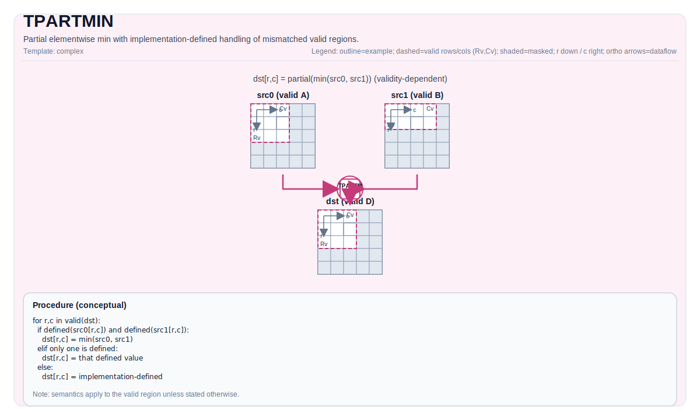

# TPARTMIN


## Tile Operation Diagram



## Introduction

Partial elementwise min with implementation-defined handling of mismatched valid regions.

## Math Interpretation

For each element `(i, j)` in the destination valid region:

$$
\mathrm{dst}_{i,j} =
\begin{cases}
\min(\mathrm{src0}_{i,j}, \mathrm{src1}_{i,j}) & \text{if both inputs are defined at } (i,j) \\
\mathrm{src0}_{i,j} & \text{if only src0 is defined at } (i,j) \\
\mathrm{src1}_{i,j} & \text{if only src1 is defined at } (i,j)
\end{cases}
$$

## Assembly Syntax

PTO-AS form: see `docs/grammar/PTO-AS.md`.

Synchronous form:

```text
%dst = tpartmin %src0, %src1 : !pto.tile<...> -> !pto.tile<...>
```

### IR Level 1 (SSA)

```text
%dst = pto.tpartmin %src0, %src1 : (!pto.tile<...>, !pto.tile<...>) -> !pto.tile<...>
```

### IR Level 2 (DPS)

```text
pto.tpartmin ins(%src0, %src1 : !pto.tile_buf<...>, !pto.tile_buf<...>) outs(%dst : !pto.tile_buf<...>)
```
## C++ Intrinsic

Declared in `include/pto/common/pto_instr.hpp`:

```cpp
template <typename TileDataDst, typename TileDataSrc0, typename TileDataSrc1, typename... WaitEvents>
PTO_INST RecordEvent TPARTMIN(TileDataDst& dst, TileDataSrc0& src0, TileDataSrc1& src1, WaitEvents&... events);
```

## Constraints

- **Implementation checks (A2A3)**:
  - `dst/src0/src1` element types must be identical, and must be one of: `int32_t`, `int16_t`, `half`, `float`.
  - All three tiles must be row-major (`isRowMajor`).
  - Runtime: if `dst.GetValidRow() == 0` or `dst.GetValidCol() == 0`, the op returns early.
  - Runtime: the implementation requires at least one input's valid region to match `dst`'s valid region, and the onther's valid region not greater than `dst`'s valid region (otherwise it asserts).
- **Implementation checks (A5)**:
  - `dst/src0/src1` element types must be identical and must be one of: `int8_t`, `uint8_t`, `int16_t`, `uint16_t`, `int32_t`, `uint32_t`, `half`, `bfloat16_t`, `float`.
  - Runtime: if any of `src0/src1/dst` has a zero valid region, the op returns early.
  - Requires `src0` and `src1` valid region to be `<= dst` valid region in both dimensions; other patterns are not supported (target-defined behavior).

## Examples

### Auto

```cpp
#include <pto/pto-inst.hpp>

using namespace pto;

void example_auto() {
  using TileT = Tile<TileType::Vec, float, 16, 16>;
  TileT src0, src1, dst;
  TPARTMIN(dst, src0, src1);
}
```

### Manual

```cpp
#include <pto/pto-inst.hpp>

using namespace pto;

void example_manual() {
  using TileT = Tile<TileType::Vec, float, 16, 16>;
  TileT src0, src1, dst;
  TASSIGN(src0, 0x1000);
  TASSIGN(src1, 0x2000);
  TASSIGN(dst,  0x3000);
  TPARTMIN(dst, src0, src1);
}
```
