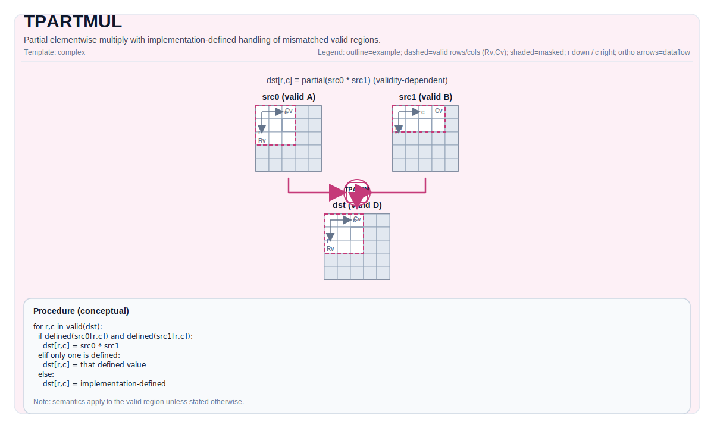

# TPARTMUL


## Tile Operation Diagram



## Introduction

Partial elementwise multiply with implementation-defined handling of mismatched valid regions.

## Math Interpretation

For each element `(i, j)` in the destination valid region:

$$
\mathrm{dst}_{i,j} =
egin{cases}
\mathrm{src0}_{i,j} \cdot \mathrm{src1}_{i,j} & 	ext{if both inputs are defined at } (i,j) \
\mathrm{src0}_{i,j} & 	ext{if only src0 is defined at } (i,j) \
\mathrm{src1}_{i,j} & 	ext{if only src1 is defined at } (i,j)
\end{cases}
$$

## Assembly Syntax

PTO-AS form: see `docs/grammar/PTO-AS.md`.

Synchronous form:

```text
%dst = tpartmul %src0, %src1 : !pto.tile<...> -> !pto.tile<...>
```

### IR Level 1 (SSA)

```text
%dst = pto.tpartmul %src0, %src1 : !pto.tile<...> -> !pto.tile<...>
```

### IR Level 2 (DPS)

```text
pto.tpartmul ins(%src0, %src1 : !pto.tile_buf<...>) outs(%dst : !pto.tile_buf<...>)
```
## C++ Intrinsic

Declared in `include/pto/common/pto_instr.hpp`:

```cpp
template <typename TileDataDst, typename TileDataSrc0, typename TileDataSrc1, typename... WaitEvents>
PTO_INST RecordEvent TPARTMUL(TileDataDst &dst, TileDataSrc0 &src0, TileDataSrc1 &src1, WaitEvents &... events);
```

## Constraints

- Element type/layout legality follows backend checks and is analogous to `TPARTADD` / `TPARTMAX` / `TPARTMIN`.
- Destination valid region defines the result domain.
- Partial-validity handling is implementation-defined for unsupported shape combinations.

## Examples

### Auto

```cpp
#include <pto/pto-inst.hpp>
using namespace pto;

void example_auto() {
  using TileT = Tile<TileType::Vec, float, 16, 16>;
  TileT src0, src1, dst;
  TPARTMUL(dst, src0, src1);
}
```

### Manual

```cpp
#include <pto/pto-inst.hpp>
using namespace pto;

void example_manual() {
  using TileT = Tile<TileType::Vec, float, 16, 16>;
  TileT src0, src1, dst;
  TASSIGN(src0, 0x1000);
  TASSIGN(src1, 0x2000);
  TASSIGN(dst,  0x3000);
  TPARTMUL(dst, src0, src1);
}
```
