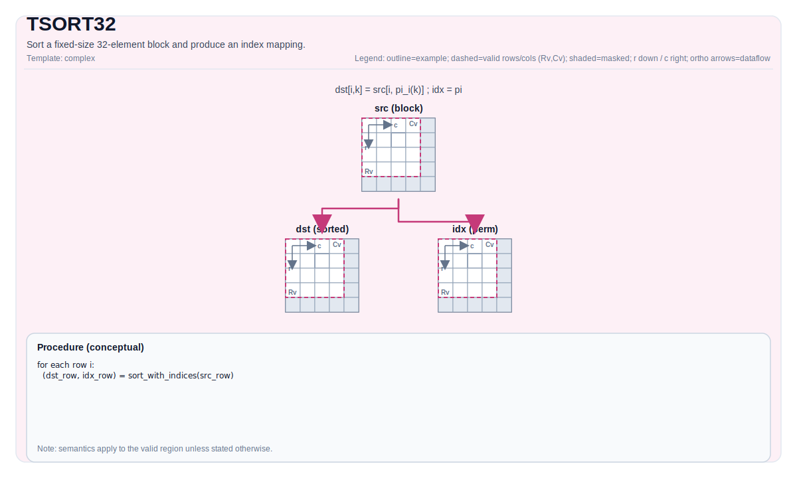

# TSORT32


## Tile Operation Diagram



## Introduction

Sort a fixed-size 32-element block and produce an index mapping.

## Math Interpretation

Sorts values from `src` into `dst` and produces an index mapping in `idx`. Conceptually, for each row `i`:

$$ \mathrm{dst}_{i,k} = \mathrm{src}_{i,\pi_i(k)} $$

where $\pi_i$ is a permutation of the indices in the row. Sort order and stability are target-defined.

## Assembly Syntax

PTO-AS form: see `docs/grammar/PTO-AS.md`.

Synchronous form:

```text
%dst, %idx = tsort32 %src : !pto.tile<...> -> (!pto.tile<...>, !pto.tile<...>)
```

### IR Level 1 (SSA)

```text
%dst, %idx = pto.tsort32 %src : !pto.tile<...> -> (!pto.tile<...>, !pto.tile<...>)
```

### IR Level 2 (DPS)

```text
pto.tsort32 ins(%src : !pto.tile_buf<...>) outs(%dst, %idx : !pto.tile_buf<...>, !pto.tile_buf<...>)
```
## C++ Intrinsic

Declared in `include/pto/common/pto_instr.hpp`:

```cpp
template <typename DstTileData, typename SrcTileData, typename IdxTileData>
PTO_INST RecordEvent TSORT32(DstTileData& dst, SrcTileData& src, IdxTileData& idx);

template <typename DstTileData, typename SrcTileData, typename IdxTileData, typename TmpTileData>
PTO_INST RecordEvent TSORT32(DstTileData& dst, SrcTileData& src, IdxTileData& idx, TmpTileData& tmp);
```

## Constraints

- `TSORT32` does not take `WaitEvents&...` and does not call `TSYNC(...)` internally; synchronize explicitly if needed.
- **Implementation checks (A2A3/A5)**:
  - `DstTileData::DType` must be `half` or `float`.
  - `SrcTileData::DType` must match `DstTileData::DType`.
  - `IdxTileData::DType` must be `uint32_t`.
  - `dst/src/idx` tile location must be `TileType::Vec`, and all must be row-major (`isRowMajor`).
- **Valid region**:
  - The implementation uses `dst.GetValidRow()` as the number of rows and uses `src.GetValidCol()` to determine how many 32-element blocks to sort per row.

## Examples

### Auto

```cpp
#include <pto/pto-inst.hpp>

using namespace pto;

void example_auto() {
  using SrcT = Tile<TileType::Vec, float, 1, 32>;
  using DstT = Tile<TileType::Vec, float, 1, 32>;
  using IdxT = Tile<TileType::Vec, uint32_t, 1, 32>;
  SrcT src;
  DstT dst;
  IdxT idx;
  TSORT32(dst, src, idx);
}
```

### Manual

```cpp
#include <pto/pto-inst.hpp>

using namespace pto;

void example_manual() {
  using SrcT = Tile<TileType::Vec, float, 1, 32>;
  using DstT = Tile<TileType::Vec, float, 1, 32>;
  using IdxT = Tile<TileType::Vec, uint32_t, 1, 32>;
  SrcT src;
  DstT dst;
  IdxT idx;
  TASSIGN(src, 0x1000);
  TASSIGN(dst, 0x2000);
  TASSIGN(idx, 0x3000);
  TSORT32(dst, src, idx);
}
```
